# How to develop an extension on SAP Cloud Platform UI5

## Prerequisites

- **You have SAP UI5 development expertise:** advanced skills are not required but a basic level would be very helpful. A variety of resources can be found on the **[Official Website](https://sapui5.hana.ondemand.com/)**.

- **You have an account on SAP Cloud Platform:** if you don't have an account, follow this **[tutorial](https://developers.sap.com/tutorials/hcp-create-trial-account.html)** to create one.

- **You should have some knowledge about the new SAP Business Application Studio:** check out the **[official documentation](https://help.sap.com/viewer/9d1db9835307451daa8c930fbd9ab264/Cloud/en-US)** or join the **[community](https://community.sap.com/topics/business-application-studio)**.

- **You have set up the SAP Business Application Studio for development:** if you have not set it up yet, follow this **[tutorial](https://developers.sap.com/tutorials/appstudio-onboarding.html)**.

## Create a Dev Space

- Goto the "SAP Business Application Studio" and click on the button "Create Dev Space".


- Enter ```fsmDemo``` in the Dev Space **name**, select **SAP Fiori"** from the list "kind of application" and then click on the button "Create Dev Space".

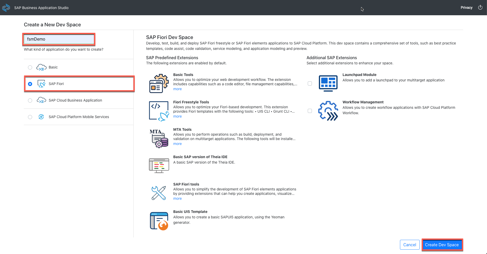

- Wait until the workspace is created and **"Running"**. Click on the name of the workspace to navigate to the development IDE.


## Connect to a Cloud Foundry endpoint

- Click on the message "The organization and space in Cloud Foundry have not been set", it is shown on the bottom-left corner.


- Select the endpoint you want to use. The one assigned to your sub-account will be listed as the main option by default (The url may be different depending on the region you've chosen).


- Enter your E-mail and password.


- Select the CF organization and workspace.


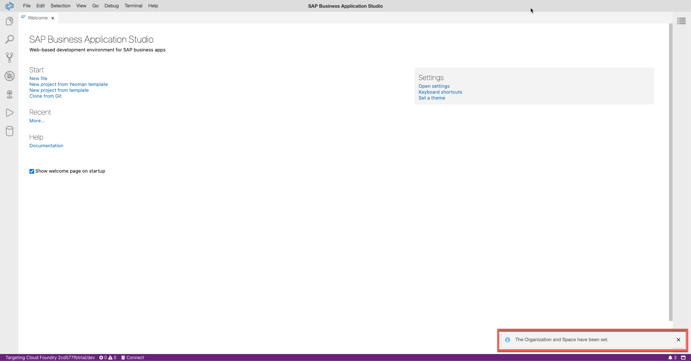

## Create a new extension project

- Click on **"New project from template"**.

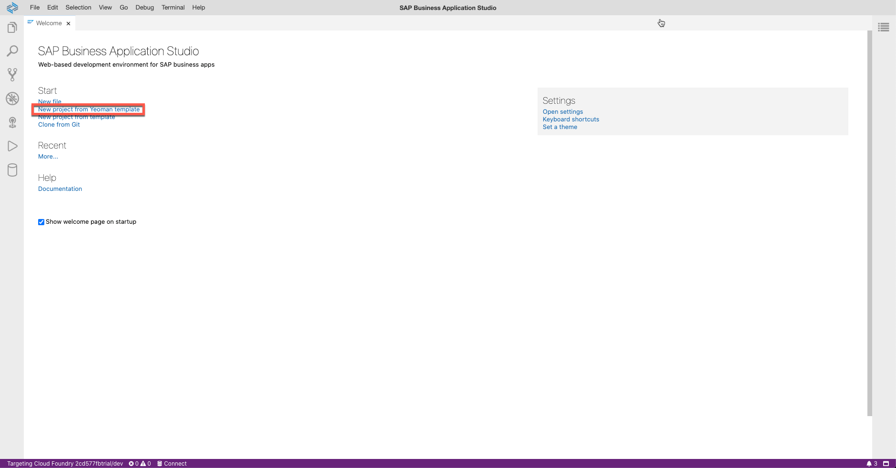

- Select **"SAP Fiori Freestyle - Project Generator""** and click on the button "Next".

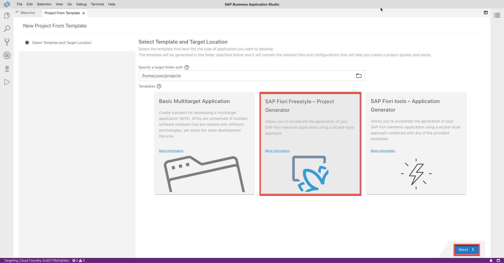

- Select "Cloud Foundry" from the list of "Target Running Environment", "SAP UI5 Application" as template and click on the button "Next".

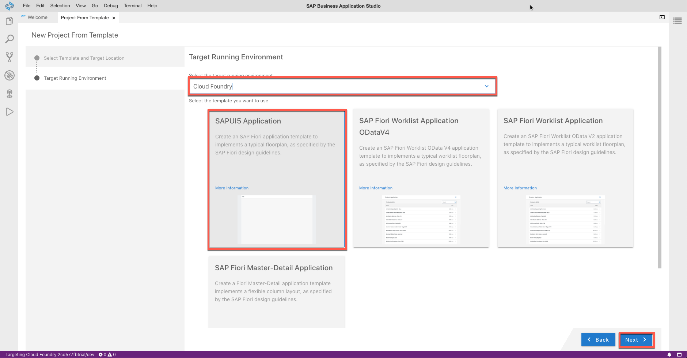

- Enter ```fsm-demo``` in the name of the project.
  
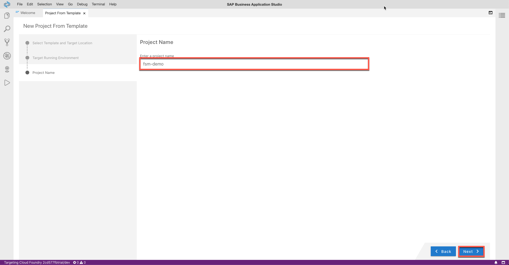

- Select "Standard Approuter" from the list of "HTML5 Application Runtime"

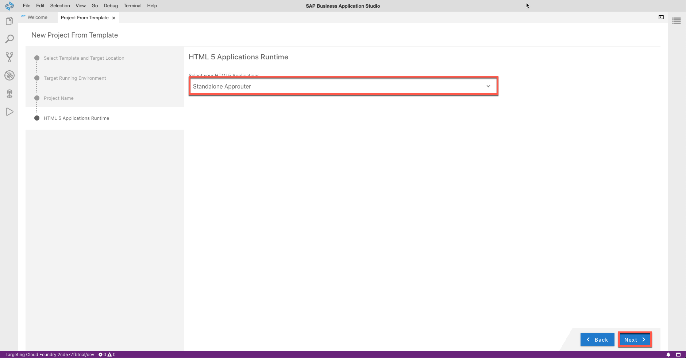

- Enter ```ui5``` in the name of the "HTML5 module", ```sap.cp``` in the name of the "namespace" and click on the button "Next".

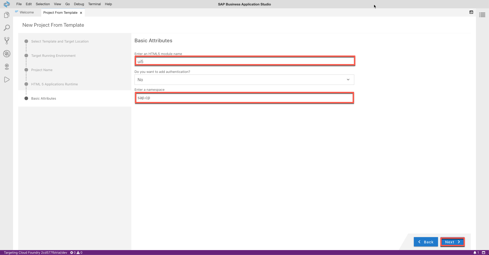

- In the next screen, click on the button "Next".

- Click on the button "Open in New Workspace".

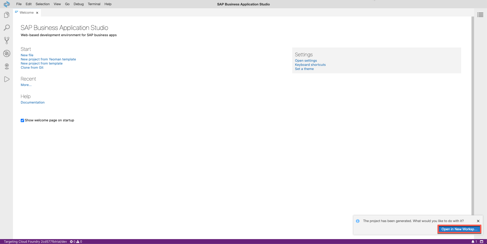

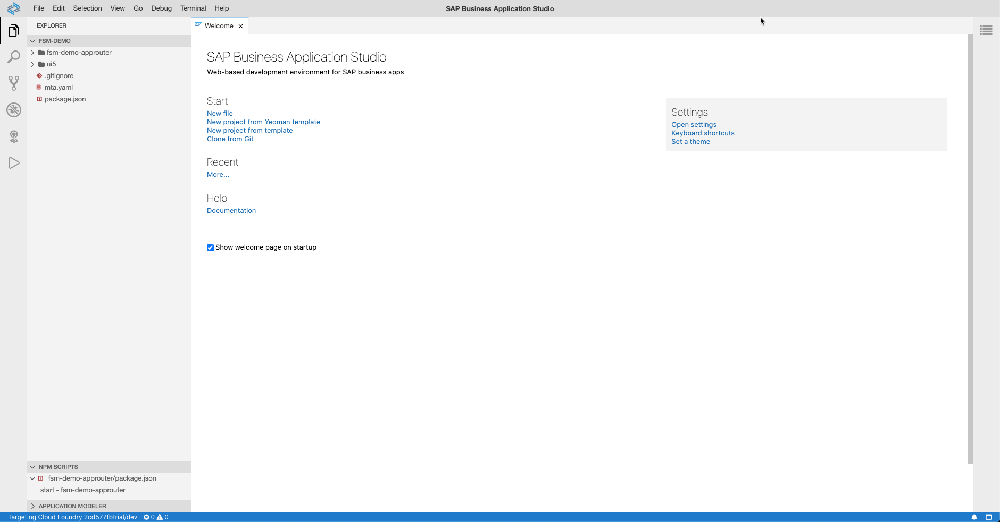

## Adjust the extension project to be used within the Outlets in FSM

- Create a file ```appconfig.json``` under the folder ```/ui5/webapp```. This file is required to be able to register the extension project in FSM (more information  **[here](https://github.com/SAP-samples/fsm-extension-sample#appconfigjson-file)**). Copy and paste the following code:

```json
{
    "name": "fsm-scp-ui5-extension-app",
    "provider": "Roadrunner Team",
    "description": "FSM SCP UI5 Extension App",
    "version": "1.0.0",
    "icon": "",  
    "parameters": []
}
```

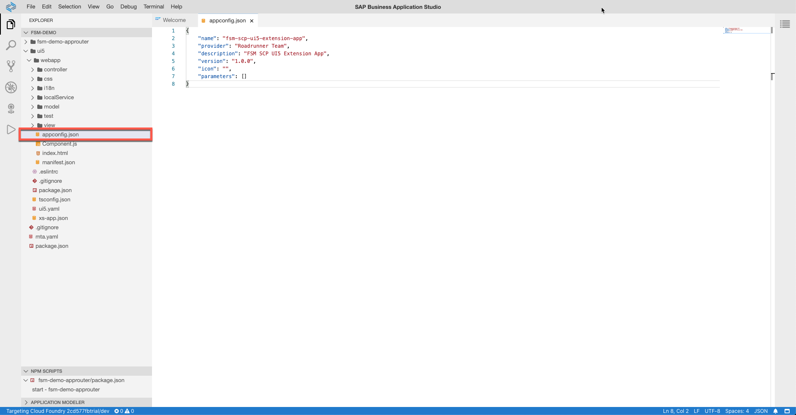

- The application router generated in the project sends by default **X-Frame-Options** header with the value **SAMEORIGIN**. We need to disable this security mechanism since the FSM Micro-frontend application and the SAPUI5 application are hosted in different domains; otherwise the extension application won't be able to run within the outlet. Following the **[documentation](https://www.npmjs.com/package/@sap/approuter#x-frame-options-configuration)** and having simplicity in mind, we have disabled this security feature by setting the property SEND_XFRAMEOPTIONS to false in the file ```mta.yaml```, as follows:
  
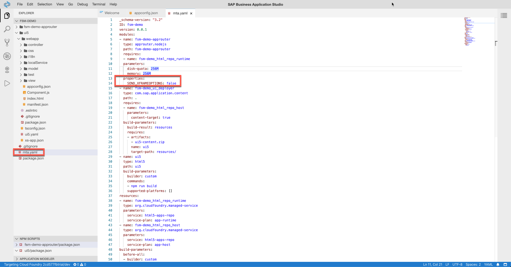

- The SAPUI5 extension app generated in the project also implements a mechanism to prevent security vulnerabilities when running within an iFrame (as described in the **[documentation](https://sapui5.hana.ondemand.com/#/topic/62d9c4d8f5ad49aa914624af9551beb7)**). Once again, we need to disable this since the FSM Micro-frontend application and the SAPUI5 application are hosted in different domains:


## Consuming the ShellSDK library

- Based on the **[official documentation](https://sap.github.io/fsm-shell/#/examples)**, to be able to consume the shellSDK library from the SAPUI5 extension app, we need to load it during the start up of the app. Copy and paste the following code in the file ```/ui5/webapp/Component.js```:
 

```javascript
// Shell SDK library
sap.ui.loader.config({
    paths: {
        "sap/coresystems/fsm-shell": "https://unpkg.com/fsm-shell@1.5.1/release/fsm-shell-client"
    },
    shim: {
        "sap/coresystems/fsm-shell": {
            amd: true,
            exports: "FSMShell"
        }
    },
    async: true
});
```


- In order to establish a communication with the FSM shell host, we need to initialize the client library and send a ```REQUIRE_CONTEXT``` event; as described **[here](https://sap.github.io/fsm-shell/#/usage-sample?id=sending-event-to-the-shell-host-application)**. Copy and paste the following code in the file ```/ui5/webapp/controller/View1.controller.js```:

```javascript
sap.ui.define([
...
    "sap/coresystems/fsm-shell"
...

return Controller.extend("sap.cp.ui5.controller.View1", {
    onInit: function () {

        const { ShellSdk, SHELL_EVENTS } = FSMShell;

        const shellSdk = ShellSdk.init(parent, '*');

        shellSdk.emit(SHELL_EVENTS.Version1.REQUIRE_CONTEXT, {
            clientIdentifier: 'fsm-demo-plugin',
        });

...
```


- To display some data pulled from FSM, let's change the template view generated within the project. Replace the content in the file ```/ui5/webapp/view/View1.view.xml``` with the following code:

```xml
<mvc:View controllerName="sap.cp.ui5.controller.View1" xmlns:mvc="sap.ui.core.mvc" displayBlock="true"  xmlns="sap.m">
    <Shell id="shell">
        <App id="app">
            <pages>
                <Page id="page" title="Attributes pulled from FSM shell app">
                <content>
                    <sap.ui.layout:Grid xmlns:sap.ui.layout="sap.ui.layout" id="grid0">
                        <sap.ui.layout:content>
                            <ObjectListItem title="account" intro="Account" icon="sap-icon://account" id="account"/>
                            <ObjectListItem title="accountID" intro="Account ID" icon="sap-icon://account" id="accountID"/>
                            <ObjectListItem title="company" intro="Company" icon="sap-icon://factory" id="company"/>
                            <ObjectListItem title="companyID" intro="Company ID" icon="sap-icon://factory" id="companyID"/>
                            <ObjectListItem title="user" intro="User" icon="sap-icon://account" id="user"/>
                            <ObjectListItem title="userID" intro="User ID" icon="sap-icon://account" id="userID"/>
                            <ObjectListItem title="locale" intro="Selected Locale" icon="sap-icon://globe" id="selLocale"/>
                        </sap.ui.layout:content>
                    </sap.ui.layout:Grid>
                </content>
                </Page>
            </pages>
        </App>
    </Shell>
</mvc:View>
```

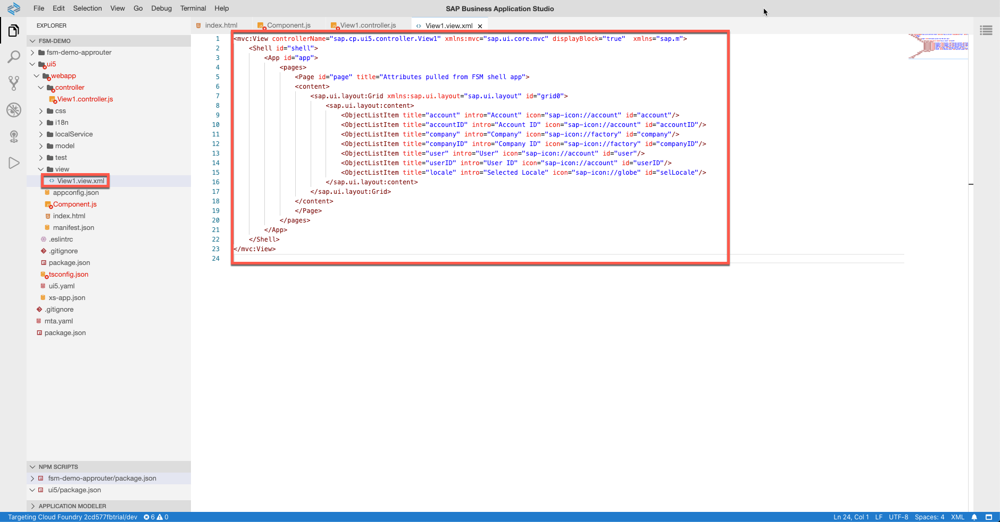

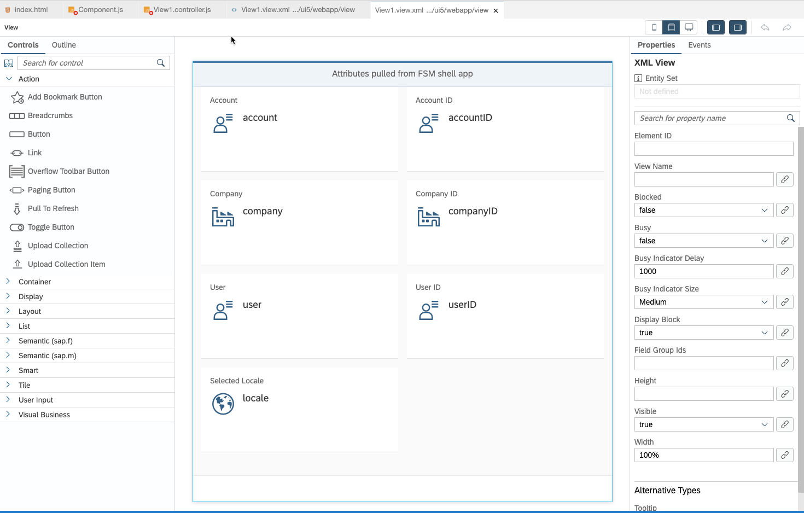

- Now adjust the controller (```/ui5/webapp/controller/View1.controller.js```) adding the following code:

```javascript
...

return Controller.extend("sap.cp.ui5module.controller.View1", {
    onInit: function () {
        const oView = this.getView();
...
...
            clientIdentifier: 'fsm-demo-plugin',
        });

        shellSdk.on(SHELL_EVENTS.Version1.REQUIRE_CONTEXT, (event) => {
            const {
                account,
                accountId,
                company,
                companyId,
                user,
                userId,
                selectedLocale,
            } = JSON.parse(event);

            oView.byId("account").setTitle(account);
            oView.byId("accountID").setTitle(accountId);
            oView.byId("company").setTitle(company);
            oView.byId("companyID").setTitle(companyId);
            oView.byId("user").setTitle(user);
            oView.byId("userID").setTitle(userId);
            oView.byId("selLocale").setTitle(selectedLocale);
        });
...
```

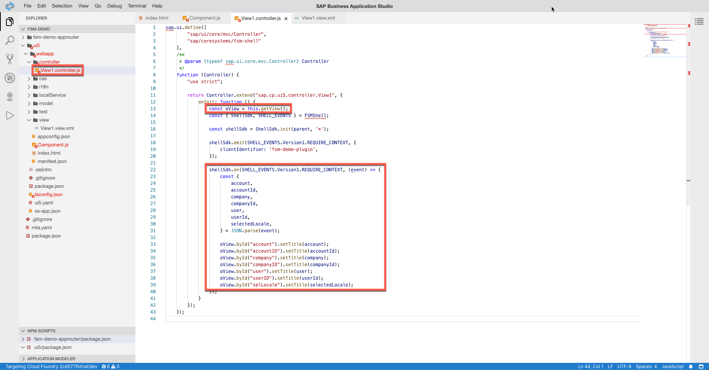

## Building, deploying and testing the SAPUI5 extension app

- In order to deploy the SAPUI5 extension app, we first need to build the project. Right click over the file ```mta.yaml``` and click on the option **"Build MTA"**:

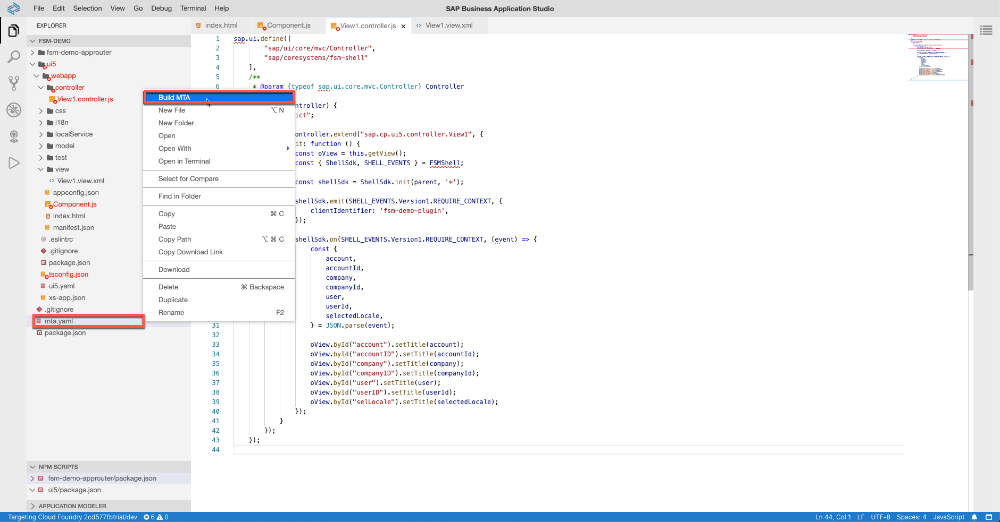

- Wait until the building process is finished. You should see a message as follows:


- The ```/ui5/dist``` and ```/mta_archives/``` folders should be created once the build is finished successfully:


- Deploy the application. Right click on the file ```fsm-demo_0.0.1.mtar``` and click on **"Deploy MTA Archive"**.


- Wait until the deployment is finished. A message should be then shown:


- To test the SAPUI5 extension app we need to know the URL we can use to get access. Start a new Terminal and execute the command ```cf apps```:

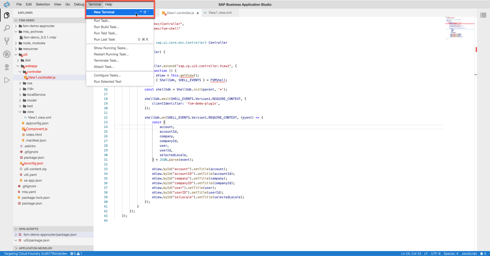

- Copy the url listed for the application ```fsm-demo-approuter```: 

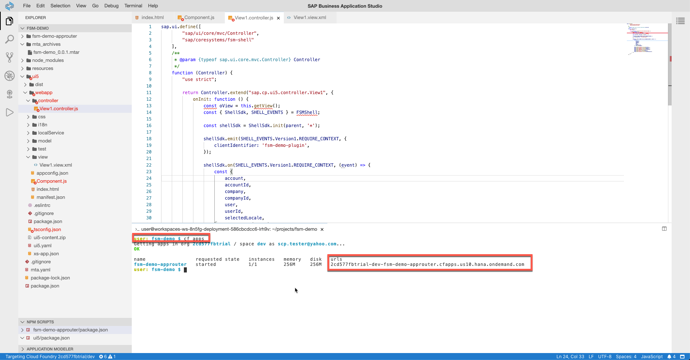

- Concatenate the "namespace" (```sap.cp```) and the name of the "HTML5 module" (```ui5```) entered when creating the extension project without any special character, dots, etc:
```https://2cd577fbtrial-dev-fsm-demo-approuter.cfapps.us10.hana.ondemand.com/sapcpui5/index.html```:

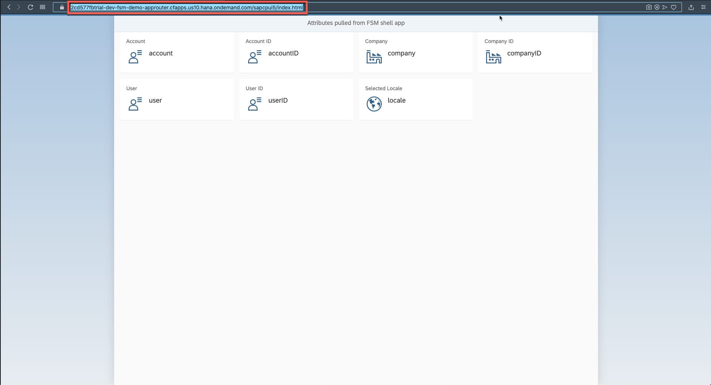

## Registering and consuming the SAPUI5 extension app

- Login to the FSM Shell Application, navigate to the "Foundational Services", "Extension Apps" and click on the button "Add Extension App":

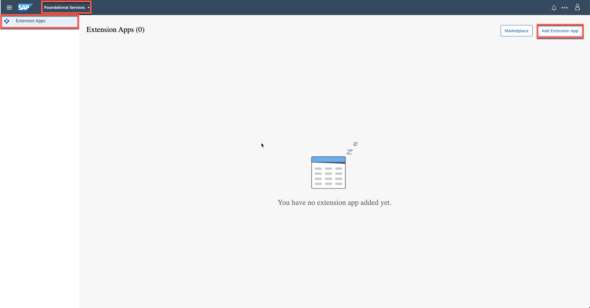

- Register the SAPUI5 extension app by selecting "Manual" from the list of "Deployment Type" and entering the URL of the SAPUI5 extension app (make sure you exclude the ```index.html```). The URL should look like this ```https://2cd577fbtrial-dev-fsm-demo-approuter.cfapps.us10.hana.ondemand.com/sapcpui5/```. Then click on the button "Next":

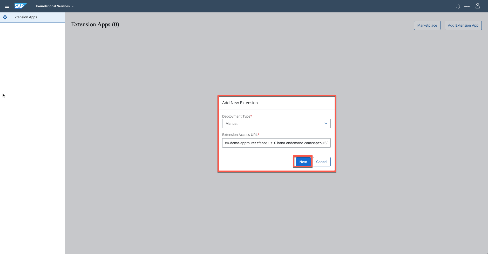

- Click on the button "Install" to finish the registration,

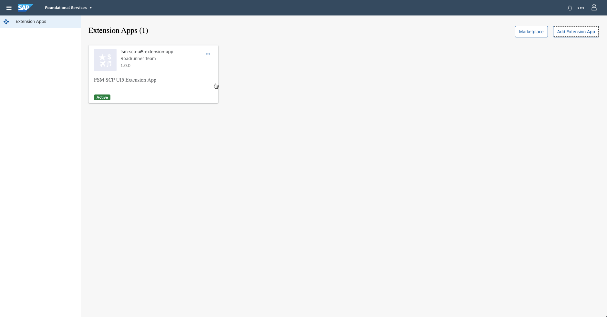

- Enable the "Extension Configuration" option from the "three dots menu":

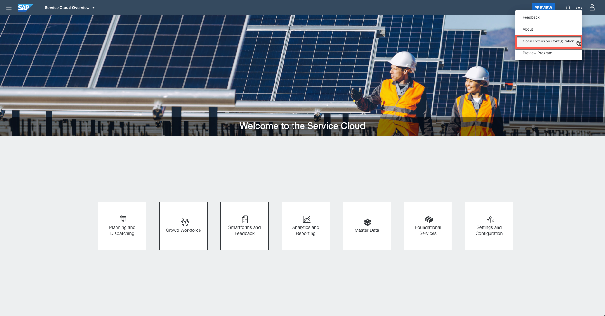

- Navigate to "Planning and Dispatching", "Dispatching Board", click on the "Add Plug-in" button, select the SAPUI5 extension app amd click on the button "Add":

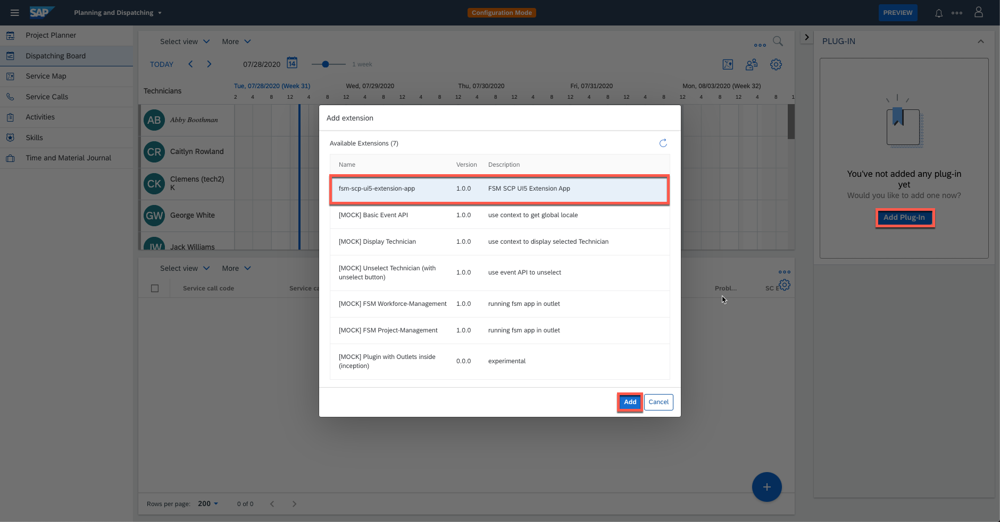

- The SAPUI5 extension app is loaded as an extension and displays information pulled from FSM:


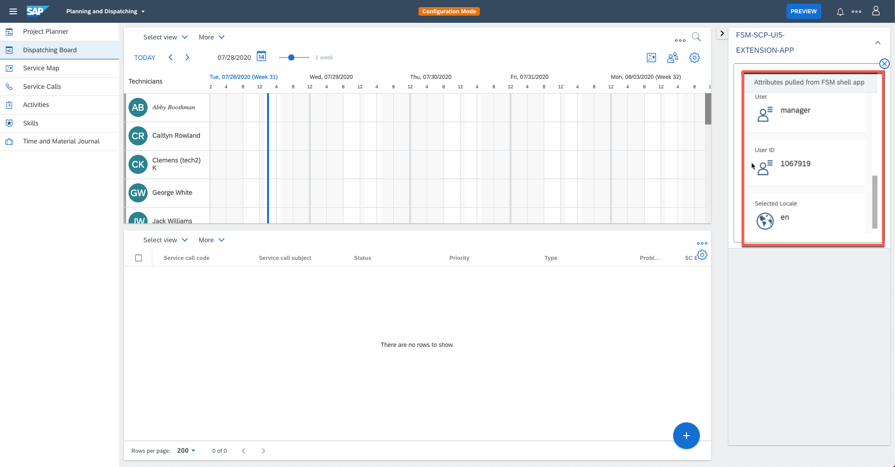